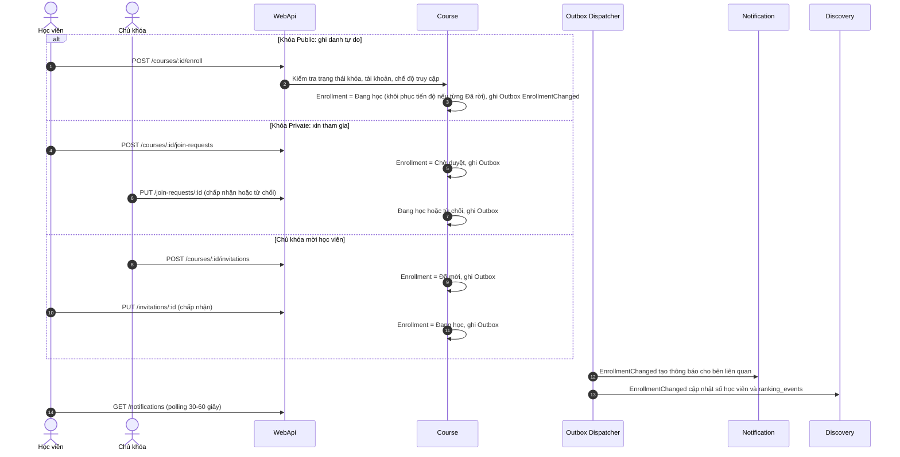
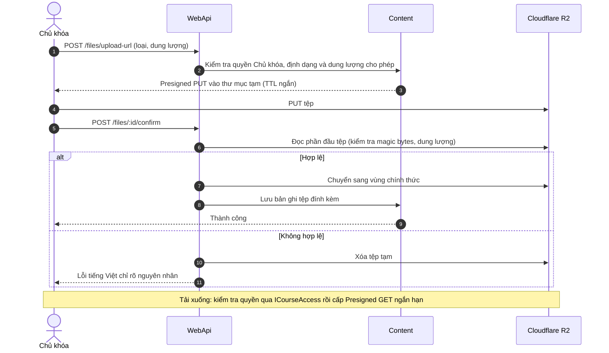
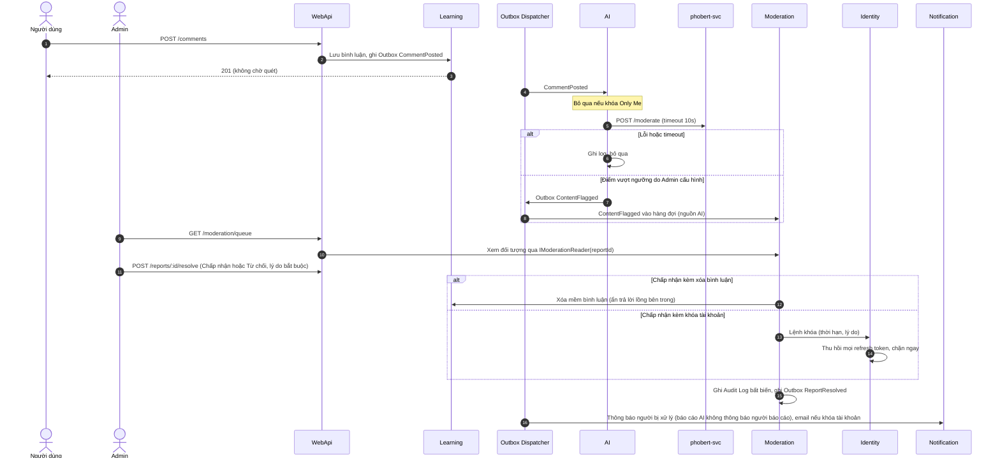
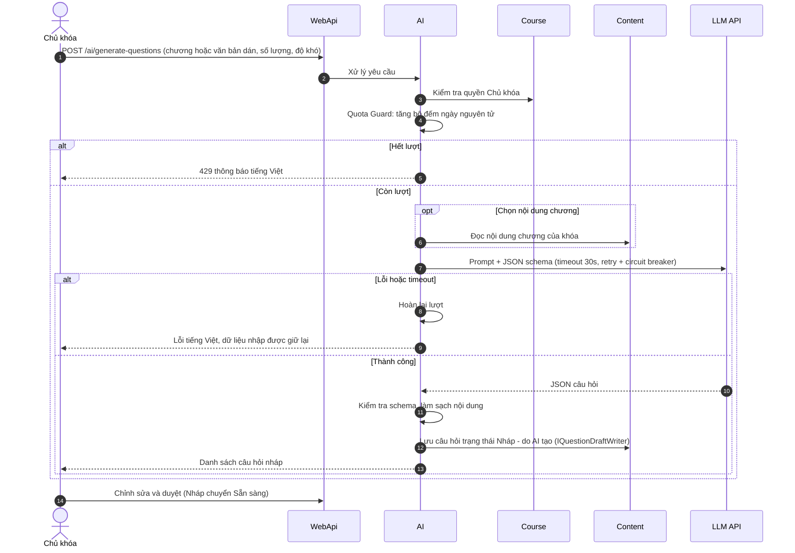

## Sequence: Ghi danh, mời, duyệt tham gia

```mermaid
sequenceDiagram
    autonumber
    actor HV as Học viên
    actor CK as Chủ khóa
    participant API as WebApi
    participant CRS as Course
    participant OB as Outbox Dispatcher
    participant NTF as Notification
    participant DSC as Discovery

    alt Khóa Public: ghi danh tự do
        HV->>API: POST /courses/:id/enroll
        API->>CRS: Kiểm tra trạng thái khóa, tài khoản, chế độ truy cập
        CRS->>CRS: Enrollment = Đang học (khôi phục tiến độ nếu từng Đã rời), ghi Outbox EnrollmentChanged
    else Khóa Private: xin tham gia
        HV->>API: POST /courses/:id/join-requests
        CRS->>CRS: Enrollment = Chờ duyệt, ghi Outbox
        CK->>API: PUT /join-requests/:id (chấp nhận hoặc từ chối)
        CRS->>CRS: Đang học hoặc từ chối, ghi Outbox
    else Chủ khóa mời học viên
        CK->>API: POST /courses/:id/invitations
        CRS->>CRS: Enrollment = Đã mời, ghi Outbox
        HV->>API: PUT /invitations/:id (chấp nhận)
        CRS->>CRS: Enrollment = Đang học, ghi Outbox
    end
    OB->>NTF: EnrollmentChanged tạo thông báo cho bên liên quan
    OB->>DSC: EnrollmentChanged cập nhật số học viên và ranking_events
    HV->>API: GET /notifications (polling 30-60 giây)
```

## Sequence: Tải tệp lên

```mermaid
sequenceDiagram
    autonumber
    actor CK as Chủ khóa
    participant API as WebApi
    participant CNT as Content
    participant R2 as Cloudflare R2

    CK->>API: POST /files/upload-url (loại, dung lượng)
    API->>CNT: Kiểm tra quyền Chủ khóa, định dạng và dung lượng cho phép
    CNT-->>CK: Presigned PUT vào thư mục tạm (TTL ngắn)
    CK->>R2: PUT tệp
    CK->>API: POST /files/:id/confirm
    API->>R2: Đọc phần đầu tệp (kiểm tra magic bytes, dung lượng)
    alt Hợp lệ
        API->>R2: Chuyển sang vùng chính thức
        API->>CNT: Lưu bản ghi tệp đính kèm
        CNT-->>CK: Thành công
    else Không hợp lệ
        API->>R2: Xóa tệp tạm
        API-->>CK: Lỗi tiếng Việt chỉ rõ nguyên nhân
    end
    Note over CK,R2: Tải xuống: kiểm tra quyền qua ICourseAccess rồi cấp Presigned GET ngắn hạn
```

## Sequence: Quét vi phạm (PhoBERT), hàng đợi báo cáo, xử lý, chế tài

```mermaid
sequenceDiagram
    autonumber
    actor U as Người dùng
    actor AD as Admin
    participant API as WebApi
    participant LRN as Learning
    participant OB as Outbox Dispatcher
    participant AI as AI
    participant PHO as phobert-svc
    participant MOD as Moderation
    participant IDN as Identity
    participant NTF as Notification

    U->>API: POST /comments
    API->>LRN: Lưu bình luận, ghi Outbox CommentPosted
    LRN-->>U: 201 (không chờ quét)
    OB->>AI: CommentPosted
    Note over AI: Bỏ qua nếu khóa Only Me
    AI->>PHO: POST /moderate (timeout 10s)
    alt Lỗi hoặc timeout
        AI->>AI: Ghi log, bỏ qua
    else Điểm vượt ngưỡng do Admin cấu hình
        AI->>OB: Outbox ContentFlagged
        OB->>MOD: ContentFlagged vào hàng đợi (nguồn AI)
    end
    AD->>API: GET /moderation/queue
    API->>MOD: Xem đối tượng qua IModerationReader(reportId)
    AD->>API: POST /reports/:id/resolve (Chấp nhận hoặc Từ chối, lý do bắt buộc)
    alt Chấp nhận kèm xóa bình luận
        MOD->>LRN: Xóa mềm bình luận (ẩn trả lời lồng bên trong)
    else Chấp nhận kèm khóa tài khoản
        MOD->>IDN: Lệnh khóa (thời hạn, lý do)
        IDN->>IDN: Thu hồi mọi refresh token, chặn ngay
    end
    MOD->>MOD: Ghi Audit Log bất biến, ghi Outbox ReportResolved
    OB->>NTF: Thông báo người bị xử lý (báo cáo AI không thông báo người báo cáo), email nếu khóa tài khoản
```

## Sequence: Sinh quiz bằng AI

```mermaid
sequenceDiagram
    autonumber
    actor CK as Chủ khóa
    participant API as WebApi
    participant AI as AI
    participant CRS as Course
    participant CNT as Content
    participant LLM as LLM API

    CK->>API: POST /ai/generate-questions (chương hoặc văn bản dán, số lượng, độ khó)
    API->>AI: Xử lý yêu cầu
    AI->>CRS: Kiểm tra quyền Chủ khóa
    AI->>AI: Quota Guard: tăng bộ đếm ngày nguyên tử
    alt Hết lượt
        AI-->>CK: 429 thông báo tiếng Việt
    else Còn lượt
        opt Chọn nội dung chương
            AI->>CNT: Đọc nội dung chương của khóa
        end
        AI->>LLM: Prompt + JSON schema (timeout 30s, retry + circuit breaker)
        alt Lỗi hoặc timeout
            AI->>AI: Hoàn lại lượt
            AI-->>CK: Lỗi tiếng Việt, dữ liệu nhập được giữ lại
        else Thành công
            LLM-->>AI: JSON câu hỏi
            AI->>AI: Kiểm tra schema, làm sạch nội dung
            AI->>CNT: Lưu câu hỏi trạng thái Nháp - do AI tạo (IQuestionDraftWriter)
            AI-->>CK: Danh sách câu hỏi nháp
        end
    end
    CK->>API: Chỉnh sửa và duyệt (Nháp chuyển Sẵn sàng)
```

